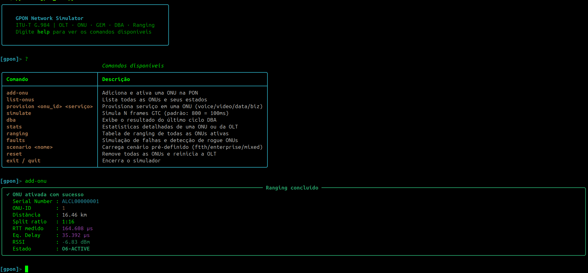

# GPON Simulator (ITU-T G.984)

Um simulador de rede **GPON (Gigabit Passive Optical Network)** desenvolvido em Python, com foco em demonstrar os principais conceitos definidos pela recomendação **ITU-T G.984**. O projeto implementa desde o processo de ativação das ONUs até o algoritmo de **Dynamic Bandwidth Allocation (DBA)**, permitindo visualizar o comportamento de uma rede GPON de forma interativa.





## Estrutura do Projeto

```
.
├── gpon_core.py    # Motor da simulação GPON
└── gpon_cli.py     # Interface interativa (REPL)
```

## Requisitos

* Python 3.9+
* Biblioteca `rich`

Instale a dependência:

```bash
pip install rich
```

## Como executar

```bash
python3 gpon_cli.py
```

Após iniciar, será exibido um terminal interativo para controlar a simulação.

---

# Funcionalidades

## `gpon_core.py`

Motor principal da simulação que implementa diversos aspectos da recomendação **ITU-T G.984**.

### ✔ Máquina de Estados da ONU

Implementa o ciclo completo de estados da ONU conforme a G.984.3:

```
O1 → O2 → O3 → O4 → O5 → O6
```

Incluindo:

* Descoberta da ONU
* Sincronização
* Serial Number exchange
* Ranging
* Operação normal

---

### ✔ Ranging Real

O simulador calcula:

* RTT baseado na distância física entre OLT e ONU
* Equalization Delay
* Alinhamento temporal de todas as ONUs para um mesmo RTT virtual

---

### ✔ Orçamento Óptico

Modelo simplificado de perda óptica considerando:

* Atenuação da fibra (0,35 dB/km)
* Perdas do splitter
* RSSI recebido na OLT

---

### ✔ Implementação de T-CONTs

Todos os tipos previstos pela recomendação:

| Tipo | Serviço     | Característica         |
| ---- | ----------- | ---------------------- |
| 1    | CBR         | Banda fixa             |
| 2    | Assured     | Banda garantida        |
| 3    | Non-Assured | Garantida + excedente  |
| 4    | Best-Effort | Apenas excedente       |
| 5    | Misto       | Combinação de serviços |

---

### ✔ DBA (Dynamic Bandwidth Allocation)

O algoritmo segue três etapas:

1. Fixed Bandwidth
2. Assured Bandwidth
3. Best-Effort proporcional

Permitindo observar como diferentes serviços competem pelos recursos da PON.

---

### ✔ Geração de Tráfego

Perfis distintos para diferentes aplicações, como:

* Voz
* Vídeo (IPTV)
* Internet residencial
* Serviços corporativos

---

### ✔ Detecção de Rogue ONU

Inclui uma heurística para identificar ONUs potencialmente defeituosas utilizando:

* RSSI anormal
* Erros BIP
* Comportamento incompatível com a operação normal da PON

---

# Interface Interativa (`gpon_cli.py`)

A aplicação disponibiliza um REPL para criação de cenários, provisionamento de serviços e execução das simulações.

## Cenários

### FTTH

Cria automaticamente um ambiente residencial com:

* 8 ONUs
* Todas provisionadas
* Perfil típico de acesso FTTH

```text
scenario ftth
```

---

### Enterprise

Cria um ambiente corporativo contendo:

* 4 ONUs
* Serviços premium
* Voz
* Vídeo
* Tráfego empresarial

```text
scenario enterprise
```

---

## Adicionar ONU

Adiciona uma nova ONU informando distância e fator de divisão (split).

```text
add-onu <distância_km> <split>
```

Exemplo:

```text
add-onu 5.2 32
```

---

## Provisionar Serviço

Provisiona um novo serviço em uma ONU.

```text
provision <onu> <serviço>
```

Exemplo:

```text
provision 1 video
```

---

## Executar Simulação

Executa a simulação por um determinado intervalo.

```text
simulate <tempo_ms>
```

Exemplo:

```text
simulate 8000
```

O comando acima executa aproximadamente **8 segundos** de tráfego simulado.

---

## Visualizar Ranging

Mostra a tabela completa contendo:

* Distância
* RTT
* Equalization Delay
* RTT Equalizado

```text
ranging
```

---

## Visualizar DBA

Exibe o estado atual dos T-CONTs e a largura de banda alocada para cada ONU.

```text
dba
```

---

## Injetar Falhas

Simula degradações na rede e executa a detecção de ONUs com comportamento anômalo.

```text
faults
```

---

# Objetivos do Projeto

Este projeto foi desenvolvido para:

* Estudo de redes GPON
* Demonstração dos mecanismos definidos pela ITU-T G.984
* Ensino de DBA e T-CONTs
* Simulações de provisionamento
* Estudos sobre ranging e sincronização
* Experimentação de cenários FTTH e corporativos

---

# Licença

Sinta-se à vontade para utilizar, modificar e contribuir com o projeto.
